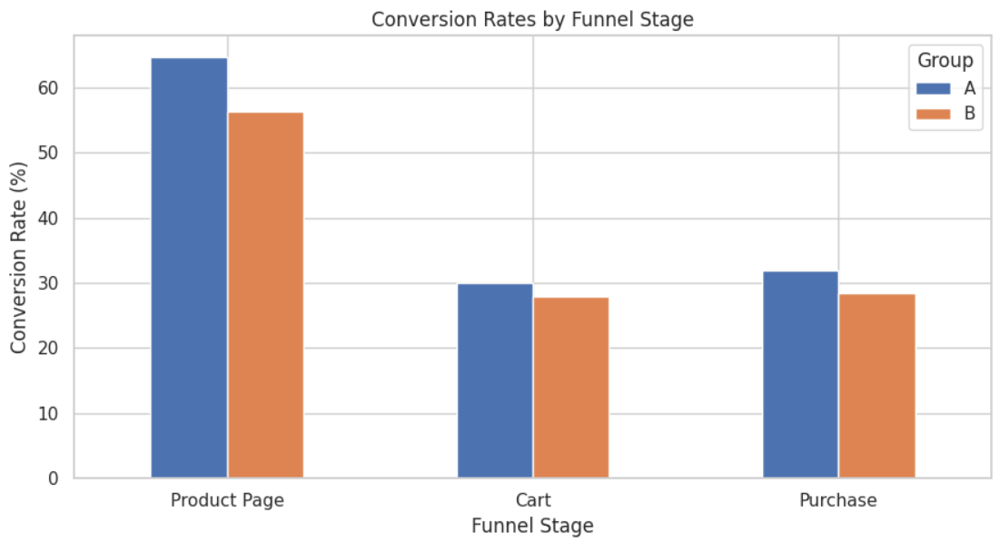
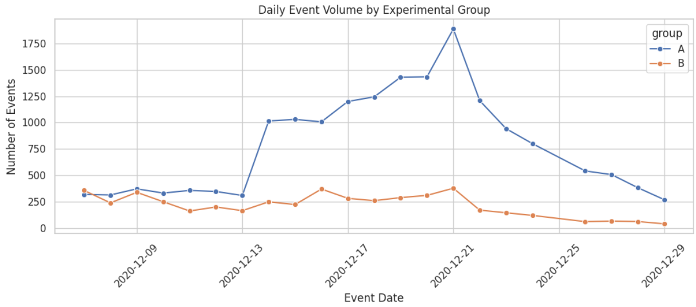

# A/B Testing Recommendation System Analysis

**Author:** Sandra Quinones Villanueva

## Project Overview

This project evaluates the effectiveness of a new recommendation system through an A/B test conducted on users from the European Union (EU) region.

The objective was to determine whether the new recommendation system improved user engagement and purchase conversion rates compared to the existing recommendation experience.

The analysis includes data preparation, exploratory data analysis (EDA), conversion funnel evaluation, statistical hypothesis testing, and business recommendations.

---

## Business Problem

An e-commerce company introduced a new recommendation system intended to increase user engagement and improve conversion performance across the purchase funnel.

To measure its impact, an A/B test was conducted where:

* **Group A** represented the existing recommendation system (control group).
* **Group B** represented the new recommendation system (treatment group).

The primary objective was to determine whether the new recommendation system generated a measurable improvement in conversion behavior.

---

## Tools Used

* Python
* Pandas
* NumPy
* Matplotlib
* Seaborn
* SciPy
* Statistical Hypothesis Testing
* Google Colab

---

## Dataset Overview

The analysis was performed using four datasets:

| Dataset                 | Description                                             |
| ----------------------- | ------------------------------------------------------- |
| Marketing Events        | Marketing campaigns active during the experiment period |
| New Users               | User registration information                           |
| User Events             | User interactions and purchase activity                 |
| Experiment Participants | Experimental group assignments                          |

### Final Analytical Sample

* 3,481 users analyzed
* 21,952 filtered event records
* EU region users only
* First 14 days after registration

---

## Methodology

### Data Preparation

* Validated dataset structure and integrity.
* Converted date fields to datetime format.
* Filtered users assigned to the `recommender_system_test`.
* Restricted analysis to EU users.
* Included only events occurring within the first 14 days after registration.
* Verified the absence of duplicate records and cross-group contamination.

### Analysis

The following analytical techniques were applied:

* Exploratory Data Analysis (EDA)
* Conversion Funnel Analysis
* User Engagement Analysis
* Experiment Validation
* Data Visualization
* Two-Proportion Z-Test

---

## Key Findings

### Conversion Rates

| Funnel Stage | Group A | Group B |
| ------------ | ------- | ------- |
| Product Page | 64.71%  | 56.28%  |
| Product Cart | 30.03%  | 27.85%  |
| Purchase     | 31.99%  | 28.42%  |

### User Engagement

| Metric                  | Group A | Group B |
| ----------------------- | ------- | ------- |
| Average Events per User | 6.62    | 5.38    |

### Statistical Results

* Z-statistic: **-1.9717**
* P-value: **0.0486**
* Significance Level (α): **0.05**

The results indicate a statistically significant difference between the groups. However, the difference favors the control group rather than the treatment group.

---

## Visualizations

### Conversion Rates by Funnel Stage



### Daily Event Volume by Experimental Group



---

## Business Value & Recommendations

### Business Value

The analysis demonstrates how controlled experimentation can be used to evaluate product changes before full implementation.

By combining conversion funnel analysis with statistical testing, the project provides evidence-based recommendations that support product decision-making and reduce implementation risk.

### Recommendations

* Maintain the existing recommendation system rather than deploying the tested version.
* Investigate factors that may have reduced engagement within the treatment group.
* Analyze user behavior throughout the conversion funnel to identify potential friction points.
* Conduct follow-up experiments using alternative recommendation strategies.
* Continue monitoring conversion performance after future recommendation updates.

---

## Project Structure

```text
ab-testing-recommendation-system/

├── datasets/
│   ├── ab_project_marketing_events_us.csv
│   ├── final_ab_new_users_upd_us.csv
│   ├── final_ab_events_upd_us.csv
│   └── final_ab_participants_upd_us.csv

├── images/
│   ├── conversion_rates.png
│   └── daily_event_volume.png

├── AB_Testing_Recommendation_System.ipynb

└── README.md
```

## Skills Demonstrated

* Data Cleaning
* Exploratory Data Analysis (EDA)
* Conversion Funnel Analysis
* Statistical Hypothesis Testing
* A/B Testing
* Data Visualization
* Business Analytics
* Data Storytelling

* **Datasets:** `/datasets`
* **Visualizations:** `/images`
